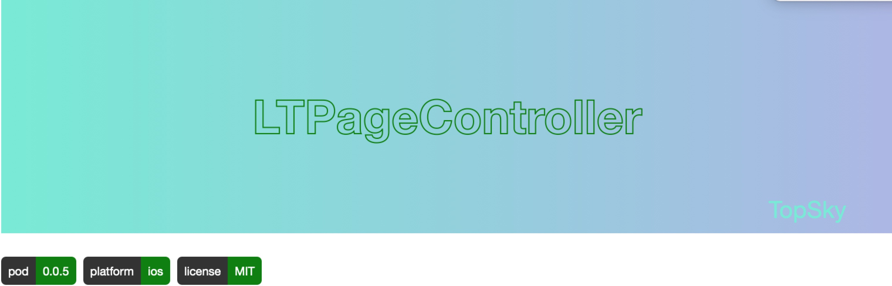

```
LTPageController是基于UIScrollView的封装。
* 提供两种基础的翻页动画的实现： 正常、层叠
* 继承协议可以自定义动画
* 提供中心缓存策略，提高运行效率，可自定义缓存的大小
```
## Requirements

* Xcode 9.0+
* Swift 4.2+
* iOS 8.0+

## Installation

* Pod
    
   LTPageController is available through [CocoaPods](http://cocoapods.org). To install
it, simply add the following line to your Podfile:

    ```
    pod 'LTPageController'
    ```
    
## Usage
* 示例图
    
     
          
* 常规用法
    
    ```
    let vc = LTPageController(delegate: self, dataSource: self, animation: LTPageControllerNormalAnimation.self, direction: .vertical)
    ```
       
* 自定义动画
    
    继承LTPageControllerAnimationProtocol协议，自定义Animation
    
    * 初始化配置     
    
        ```
        public class func config(_ pageController: LTPageController) {
            pageController.scrollView.isPagingEnabled = true
        }
        ```
    
    * 定义滑动时Controller展示的位置
        
        ```
        public class func rect(_ pageController: LTPageController, contentController: UIViewController, type: LTPageController.ScrollType, index: Int) -> CGRect {
            let width = pageController.contentWidth
            let height = pageController.contentHeight
            switch pageController.direction {
            case .horizontal:
                let originX = width * CGFloat(index)
                return CGRect(x: originX, y: 0, width: width, height: height)
            case .vertical:
                let originY = height * CGFloat(index)
                return CGRect(x: 0, y: originY, width: width, height: height)
            }
        }
        ```

* 修改当前选中

    ```
    setController(currentIndex, animated: false)
    ```

* 支持修改的属性

    ```
    pageVC.numOfPages = 7 // 页数
    pageVC.cacheSize = 3 // 缓存大小    
    ```
    
* delegate 

    index 发生改变 回调
    
    ```
    func indexChanged(_ pageController: LTPageController, index: Int)
    ```

* datasource
    
    根据index 返回对应的Controller
    
    ```
    func controller(_ pageController: LTPageController, index: Int) -> UIViewController?
    ```

        
## License
LTPageController is available under the MIT license. See the LICENSE file for more info.
    
    


